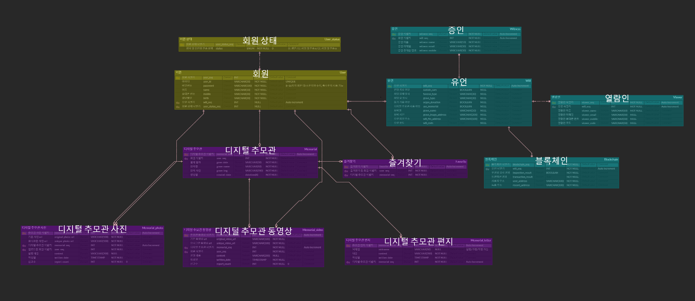

# 📃 에필로그 (E:pilogue)

### 블록체인을 이용한 디지털 유언장 생성 및 전달 서비스

- SSAFY 10기 2학기 특화 프로젝트 (블록체인)

## 👨‍👩‍👧‍👦 프로젝트 기간 및 팀원

- 팀명 : 놓고놀아 (No Coding No Life)
- 개발 기간 : 2024년 2월 19일 ~ 4월 5일 (7주)

| 강민지 (팀원) | 유병욱 (팀원) | 이현비 (팀원) |
| --- | --- | --- |
| Frontend| Frontend 리더, Block Chain | Frontend |
| **[Flutter]**<br>- Auth : 회원가입, 로그인, 휴대폰인증, 마이페이지<br>- Main : 메인 화면 및 배너, 하단 네비게이션<br>**[React]**<br>**[Figma UI/UX 디자인]**<br>**[UCC 제작]** | **[Flutter]**<br>- 블록체인 로직 이식<br>- 추모관 무한스크롤 퍼블리싱<br>**[Block Chain]**<br>- 스마트 컨트랙트 배포<br>- FE - Block Chain 이식<br>- IPFS : 설정 / 노드 구성 | **[Flutter]**<br>- 추모관 : 파일 업로드, 즐겨찾기, 검색, 리스트<br>- 유언 생성 : 녹음, 재생, 열람인, 증인, 선택사항<br>**[React]**<br>- 증인 유언장 열람 신청, 열람인 유언장 열람 신청, 유언장 |

| 김유나 (팀장) | 유세진 (팀원) | 한재현 (팀원) |
| --- | --- | --- |
| Backend, CI/CD | Backend, CI/CD | Backend 리더, Block Chain |
| [Backend]
- 유언 도메인 API 구현
- 유언 생성, 관련 정보 저장, 나의 유언 조회 및 삭제, 유언 열람 신청, 인증 코드 확인
- 유언 파일, 묘비 사진 S3 컨텐츠 업로드, 조회 및 삭제

[CI/CD]
- AWS EC2 기본 설정 및 Docker, Jenkins 설치
- React 빌드 및 배포 | [Backend]
- 디지털 추모관 도메인 API 구현
- 추모관 리스트, 즐겨찾기, 디테일
- No-offset 기반의 사진/동영상/편지(이하 컨텐츠) 목록 조회, S3 기반의 컨텐츠 업로드 및 조회, 신고하기

[CI/CD]
- Jenkins 초기 설치 및 기본 설정
- Jenkinsfile 및 Dockerfile 작성
- Spring Boot 자동 빌드 및 자동 배포 구축 | [Backend]
- 유저 도메인 API 구현
- Oauth2를 이용한 소셜 로그인 구현
- Spring Security + JWT를 활용하여 다른 로그인 시스템에 접근 및 권한 공유
- 자주 접근하고, 자주 바뀌지 않는 데이터를 저장하기 위해 Redis 사용 |

## ✏ 개요

 한국은 고령사회를 넘어 2025년 초고령사회의 진입을 눈앞에 두고 있습니다. 노령 인구의 증가는 유언을 통한 상속 수요를 증가시키고 있지만, 복잡한 절차 때문에 많은 사람들이 유언을 작성하지 않는 추세입니다. 실제로 금융기관 연구소 등의 조사에 따르면 응답자의 67% 이상이 유언을 작성하겠다고 답변했으나, 실제 유언을 작성한 사람은 3%에 불과했습니다. 이러한 수요를 반영해 간편하게 유언을 생성할 수 있는 서비스를 기획했습니다.

 복잡한 절차 없이 위변조 위험이 없는 유언을 남기고 싶다면, 고인의 삶과 기억을 언제 어디서든 추모하고 싶다면, **E:pilogue**를 찾아주세요😊

## 🖥️ 개발 환경

### **💻 IDE**

- Intellij `2023.3.2`
- Visual Studio Code
- Android Studio

### **🔧** BackEnd

- Oracle JDK `17`
- Spring Boot `3.2.3`
- Spring Security `6.2.1`
- Spring Data JPA `3.2.3`
- OAuth2 `2.0`
- JWT `0.12.3`
- Swagger

### **🎨** FrontEnd

- Flutter `3.19.3`
- React
- node.js `10.5.0`

### 🖇️ Block Chain

- remix IDE `paris`
- Solidity
- Web3
- Crytpo BIP32 BIP 39
- IPFS `latest(*)`

### 🗑 Database

- MySQL `8.3.0`
- Redis `7.2.4`
- AWS S3 `2.2.6`

### **🚀** Server

- AWS EC2

### ⌛ CI/CD

- Jenkins `2.448`
- Docker `24.0.2`
- Nginx `1.18.0 (Ubuntu)`

### **🤝** 협업

- GitLab
- Jira
- Notion
- Mattermost

## ⚒ 주요 기능

[기능 GIF](https://www.notion.so/GIF-2b8589131a294b7a8d05b6932bafef9e?pvs=21)

### 1️⃣ 디지털 유언 생성

- 증인 정보 입력 (최대 5명)
    - 증인 핸드폰 본인 인증 필수
    - 핸드폰 번호 및 이메일 입력 필수
- 유언 녹음 및 기록
    - 원활한 유언 녹음을 위한 스크립트 작성
    - 녹음 내용을 실시간으로 확인
    - 기록하기 버튼 클릭 시 블록체인과 IPFS에 기록
- 유언 열람인 지정 (최대 5명)
    - 핸드폰 번호 및 이메일 중 하나만 입력 가능
- 디지털 추모관 이용 여부 선택
    - 묘비명 + 묘비 사진 등록
- 추가 정보 등록
    - 연명치료 여부
    - 장기기증 여부
    - 장례 방식
    - 묘 방식

### 2️⃣ 나의 유언 조회

- 마이페이지
- 나의 유언 조회
- 블록체인을 활용한 진위 여부 확인

### 3️⃣ 디지털 추모관

- 추모관 리스트 조회
- 고인명 또는 묘비명으로 추모관 검색
- 추모관 즐겨찾기
    - 즐겨찾기한 추모관 먼저 정렬
- 개인 추모관 방문
- 고인의 사진/동영상/편지 목록 조회
- 사진 및 동영상 상세 조회
    - 사진 : 길게  클릭시 해당 게시물 크게 확인
    - 동영상 : 자동 재생
- 사진 및 동영상 업로드
    - 사진 및 영상에 대한 설명 작성
- 편지 작성
    - 실명/닉네임/익명 설정
- 사진 및 동영상 신고하기
    - 10번 이상 신고 시 해당 게시물 자동 삭제

### 4️⃣ 유언 열람 신청

- 문자 및 이메일로 전달된 링크를 통해 증인이 유언 열람 신청
- 고인 성함, 고인 생년월일, 증인 성함, 증인 코드 입력
- 고인의 사망진단서 업로드
- 신청 검토 안내

### 5️⃣ 유언 열람

- 앱 또는 웹으로 열람 가능
- 고인이 지정한 열람인이 문자 또는 이메일로 전달받은 코드 입력
- 블록체인을 통한 유언의 진위 여부 확인
- 위변조 감지 후 안내
- 위변조 시 IPFS를 사용해 원본 파일 복구

## 💡 프로젝트 진행

### Git

형상 관리 시스템으로, 프로젝트의 소스 코드 버전 관리를 위해 Git을 사용했습니다.

문제가 발생했을 때, 소스 코드의 변경 사항을 추적하여 쉽게 해결할 수 있었습니다. 또한, 다양한 브랜치를 생성하여 병합 및 테스트를 수행할 수 있으며, 이를 통해 다양한 기능을 동시에 개발하고 안정성을 유지할 수 있었습니다.

### Jira

Agile 방법론을 기반으로 한 프로젝트 관리 도구로서 Jira를 이용했습니다. 

매주 월요일 오전 회의에서 한 주동안 진행되어야 할 주 단위 계획을 짜고, 스프린트를 만들어 등록했고, 이는 각 작업에 대한 할당, 우선 순위 지정, 작업 상태 업데이트 등을 통해 프로젝트의 진행 상황을 파악하기 용이했습니다.

### Notion

효율적인 문서화 도구로서 Notion을 이용했습니다.

신기술에 대한 자료 링크,  요구사항 정의서, 아이디어 등을 모아 관리했습니다. 그리고 항상 모든 회의 및 피드백은 기록으로 남겨두어서 잘 반영할 수 있도록 하였습니다. 컨벤션 규칙, 코드 리뷰 등도 Notion에 기록하여 모두가 항시 확인할 수 있도록 관리했습니다.

### Scrum Meeting

매일 아침 9시에 어제 했던 일, 오늘 할 일, 이슈를 각자 정리해서 5~10분 동안 서로 공유하는 시간을 가졌습니다. 이를 통해 팀원들은 프로젝트의 전반적인 상태를 이해하고 필요한 조치를 취할 수 있었고, 자신의 작업을 공유하고 문제점이나 진전 사항을 토론할 수 있었습니다.

## 🔍 ERD



## 📉 시스템 아키텍처


## 🦴 Project Structure

<details>
<summary>Backend</summary>
<div markdown="1">

    📦backend
     ┣ 📂.idea
     ┃ ┣ 📂modules
     ┃ ┃ ┗ 📜epilogue.main.iml
     ┃ ┣ 📜.gitignore
     ┃ ┣ 📜backend.iml
     ┃ ┣ 📜compiler.xml
     ┃ ┣ 📜encodings.xml
     ┃ ┣ 📜gradle.xml
     ┃ ┣ 📜jarRepositories.xml
     ┃ ┣ 📜misc.xml
     ┃ ┣ 📜modules.xml
     ┃ ┣ 📜uiDesigner.xml
     ┃ ┗ 📜vcs.xml
     ┗ 📂epilogue
     ┃ ┣ 📂.gradle
     ┃ ┃ ┣ 📂8.5
     ┃ ┃ ┃ ┣ 📂checksums
     ┃ ┃ ┃ ┃ ┣ 📜checksums.lock
     ┃ ┃ ┃ ┃ ┣ 📜md5-checksums.bin
     ┃ ┃ ┃ ┃ ┗ 📜sha1-checksums.bin
     ┃ ┃ ┃ ┣ 📂dependencies-accessors
     ┃ ┃ ┃ ┃ ┣ 📜dependencies-accessors.lock
     ┃ ┃ ┃ ┃ ┗ 📜gc.properties
     ┃ ┃ ┃ ┣ 📂executionHistory
     ┃ ┃ ┃ ┃ ┣ 📜executionHistory.bin
     ┃ ┃ ┃ ┃ ┗ 📜executionHistory.lock
     ┃ ┃ ┃ ┣ 📂fileChanges
     ┃ ┃ ┃ ┃ ┗ 📜last-build.bin
     ┃ ┃ ┃ ┣ 📂fileHashes
     ┃ ┃ ┃ ┃ ┣ 📜fileHashes.bin
     ┃ ┃ ┃ ┃ ┣ 📜fileHashes.lock
     ┃ ┃ ┃ ┃ ┗ 📜resourceHashesCache.bin
     ┃ ┃ ┃ ┣ 📂vcsMetadata
     ┃ ┃ ┃ ┗ 📜gc.properties
     ┃ ┃ ┣ 📂buildOutputCleanup
     ┃ ┃ ┃ ┣ 📜buildOutputCleanup.lock
     ┃ ┃ ┃ ┣ 📜cache.properties
     ┃ ┃ ┃ ┗ 📜outputFiles.bin
     ┃ ┃ ┣ 📂vcs-1
     ┃ ┃ ┃ ┗ 📜gc.properties
     ┃ ┃ ┗ 📜file-system.probe
     ┃ ┣ 📂.idea
     ┃ ┃ ┣ 📂modules
     ┃ ┃ ┃ ┗ 📜epilogue.main.iml
     ┃ ┃ ┣ 📜.gitignore
     ┃ ┃ ┣ 📜compiler.xml
     ┃ ┃ ┣ 📜gradle.xml
     ┃ ┃ ┣ 📜jarRepositories.xml
     ┃ ┃ ┣ 📜misc.xml
     ┃ ┃ ┣ 📜modules.xml
     ┃ ┃ ┣ 📜vcs.xml
     ┃ ┃ ┗ 📜workspace.xml
     ┃ ┣ 📂build
     ┃ ┃ ┣ 📂classes
     ┃ ┃ ┃ ┗ 📂java
     ┃ ┃ ┃ ┃ ┗ 📂main
     ┃ ┃ ┃ ┃ ┃ ┗ 📂com
     ┃ ┃ ┃ ┃ ┃ ┃ ┗ 📂epilogue
     ┃ ┃ ┃ ┃ ┃ ┃ ┃ ┣ 📂config
     ┃ ┃ ┃ ┃ ┃ ┃ ┃ ┃ ┣ 📜OpenApiConfig.class
     ┃ ┃ ┃ ┃ ┃ ┃ ┃ ┃ ┣ 📜QueryDSLConfig.class
     ┃ ┃ ┃ ┃ ┃ ┃ ┃ ┃ ┣ 📜RedisConfig.class
     ┃ ┃ ┃ ┃ ┃ ┃ ┃ ┃ ┣ 📜S3Config.class
     ┃ ┃ ┃ ┃ ┃ ┃ ┃ ┃ ┗ 📜SecurityConfig.class
     ┃ ┃ ┃ ┃ ┃ ┃ ┃ ┣ 📂controller
     ┃ ┃ ┃ ┃ ┃ ┃ ┃ ┃ ┣ 📜LoginController.class
     ┃ ┃ ┃ ┃ ┃ ┃ ┃ ┃ ┣ 📜MemorialController.class
     ┃ ┃ ┃ ┃ ┃ ┃ ┃ ┃ ┣ 📜ReissueController.class
     ┃ ┃ ┃ ┃ ┃ ┃ ┃ ┃ ┣ 📜SmsCertificationController.class
     ┃ ┃ ┃ ┃ ┃ ┃ ┃ ┃ ┣ 📜TestController.class
     ┃ ┃ ┃ ┃ ┃ ┃ ┃ ┃ ┣ 📜UserController.class
     ┃ ┃ ┃ ┃ ┃ ┃ ┃ ┃ ┗ 📜WillController.class
     ┃ ┃ ┃ ┃ ┃ ┃ ┃ ┣ 📂domain
     ┃ ┃ ┃ ┃ ┃ ┃ ┃ ┃ ┣ 📂auth
     ┃ ┃ ┃ ┃ ┃ ┃ ┃ ┃ ┃ ┣ 📜CustomOAuth2User$1.class
     ┃ ┃ ┃ ┃ ┃ ┃ ┃ ┃ ┃ ┗ 📜CustomOAuth2User.class
     ┃ ┃ ┃ ┃ ┃ ┃ ┃ ┃ ┣ 📂memorial
     ┃ ┃ ┃ ┃ ┃ ┃ ┃ ┃ ┃ ┣ 📜Favorite$FavoriteBuilder.class
     ┃ ┃ ┃ ┃ ┃ ┃ ┃ ┃ ┃ ┣ 📜Favorite.class
     ┃ ┃ ┃ ┃ ┃ ┃ ┃ ┃ ┃ ┣ 📜Memorial$MemorialBuilder.class
     ┃ ┃ ┃ ┃ ┃ ┃ ┃ ┃ ┃ ┣ 📜Memorial.class
     ┃ ┃ ┃ ┃ ┃ ┃ ┃ ┃ ┃ ┣ 📜MemorialLetter$MemorialLetterBuilder.class
     ┃ ┃ ┃ ┃ ┃ ┃ ┃ ┃ ┃ ┣ 📜MemorialLetter.class
     ┃ ┃ ┃ ┃ ┃ ┃ ┃ ┃ ┃ ┣ 📜MemorialPhoto$MemorialPhotoBuilder.class
     ┃ ┃ ┃ ┃ ┃ ┃ ┃ ┃ ┃ ┣ 📜MemorialPhoto.class
     ┃ ┃ ┃ ┃ ┃ ┃ ┃ ┃ ┃ ┣ 📜MemorialVideo$MemorialVideoBuilder.class
     ┃ ┃ ┃ ┃ ┃ ┃ ┃ ┃ ┃ ┗ 📜MemorialVideo.class
     ┃ ┃ ┃ ┃ ┃ ┃ ┃ ┃ ┣ 📂user
     ┃ ┃ ┃ ┃ ┃ ┃ ┃ ┃ ┃ ┣ 📜User$UserBuilder.class
     ┃ ┃ ┃ ┃ ┃ ┃ ┃ ┃ ┃ ┣ 📜User.class
     ┃ ┃ ┃ ┃ ┃ ┃ ┃ ┃ ┃ ┗ 📜UserStatus.class
     ┃ ┃ ┃ ┃ ┃ ┃ ┃ ┃ ┣ 📂viewer
     ┃ ┃ ┃ ┃ ┃ ┃ ┃ ┃ ┃ ┣ 📜Viewer$ViewerBuilder.class
     ┃ ┃ ┃ ┃ ┃ ┃ ┃ ┃ ┃ ┗ 📜Viewer.class
     ┃ ┃ ┃ ┃ ┃ ┃ ┃ ┃ ┣ 📂will
     ┃ ┃ ┃ ┃ ┃ ┃ ┃ ┃ ┃ ┣ 📜Will$WillBuilder.class
     ┃ ┃ ┃ ┃ ┃ ┃ ┃ ┃ ┃ ┗ 📜Will.class
     ┃ ┃ ┃ ┃ ┃ ┃ ┃ ┃ ┗ 📂witness
     ┃ ┃ ┃ ┃ ┃ ┃ ┃ ┃ ┃ ┣ 📜Witness$WitnessBuilder.class
     ┃ ┃ ┃ ┃ ┃ ┃ ┃ ┃ ┃ ┗ 📜Witness.class
     ┃ ┃ ┃ ┃ ┃ ┃ ┃ ┣ 📂dto
     ┃ ┃ ┃ ┃ ┃ ┃ ┃ ┃ ┣ 📂request
     ┃ ┃ ┃ ┃ ┃ ┃ ┃ ┃ ┃ ┣ 📂memorial
     ┃ ┃ ┃ ┃ ┃ ┃ ┃ ┃ ┃ ┃ ┣ 📜GraveNameRequestDto.class
     ┃ ┃ ┃ ┃ ┃ ┃ ┃ ┃ ┃ ┃ ┣ 📜MemorialLetterRequestDto$MemorialLetterRequestDtoBuilder.class
     ┃ ┃ ┃ ┃ ┃ ┃ ┃ ┃ ┃ ┃ ┣ 📜MemorialLetterRequestDto.class
     ┃ ┃ ┃ ┃ ┃ ┃ ┃ ┃ ┃ ┃ ┣ 📜MemorialMediaRequestDto.class
     ┃ ┃ ┃ ┃ ┃ ┃ ┃ ┃ ┃ ┃ ┗ 📜NameRequestDto.class
     ┃ ┃ ┃ ┃ ┃ ┃ ┃ ┃ ┃ ┣ 📂user
     ┃ ┃ ┃ ┃ ┃ ┃ ┃ ┃ ┃ ┃ ┣ 📜IdCheckRequestDto.class
     ┃ ┃ ┃ ┃ ┃ ┃ ┃ ┃ ┃ ┃ ┣ 📜JoinRequestDto.class
     ┃ ┃ ┃ ┃ ┃ ┃ ┃ ┃ ┃ ┃ ┣ 📜LoginRequestDto.class
     ┃ ┃ ┃ ┃ ┃ ┃ ┃ ┃ ┃ ┃ ┣ 📜SmsCertificationRequestDto.class
     ┃ ┃ ┃ ┃ ┃ ┃ ┃ ┃ ┃ ┃ ┣ 📜UpdateInfoRequestDto.class
     ┃ ┃ ┃ ┃ ┃ ┃ ┃ ┃ ┃ ┃ ┗ 📜UpdatePasswordRequestDto.class
     ┃ ┃ ┃ ┃ ┃ ┃ ┃ ┃ ┃ ┣ 📂viewer
     ┃ ┃ ┃ ┃ ┃ ┃ ┃ ┃ ┃ ┃ ┗ 📜ViewerRequestDto.class
     ┃ ┃ ┃ ┃ ┃ ┃ ┃ ┃ ┃ ┣ 📂will
     ┃ ┃ ┃ ┃ ┃ ┃ ┃ ┃ ┃ ┃ ┣ 📜WillAdditionalRequestDto.class
     ┃ ┃ ┃ ┃ ┃ ┃ ┃ ┃ ┃ ┃ ┣ 📜WillAndWitnessRequestDto.class
     ┃ ┃ ┃ ┃ ┃ ┃ ┃ ┃ ┃ ┃ ┣ 📜WillApplyRequestDto.class
     ┃ ┃ ┃ ┃ ┃ ┃ ┃ ┃ ┃ ┃ ┗ 📜WillMemorialRequestDto.class
     ┃ ┃ ┃ ┃ ┃ ┃ ┃ ┃ ┃ ┣ 📂witness
     ┃ ┃ ┃ ┃ ┃ ┃ ┃ ┃ ┃ ┃ ┗ 📜WitnessRequestDto.class
     ┃ ┃ ┃ ┃ ┃ ┃ ┃ ┃ ┃ ┣ 📜SearchRequestDto$SearchRequestDtoBuilder.class
     ┃ ┃ ┃ ┃ ┃ ┃ ┃ ┃ ┃ ┗ 📜SearchRequestDto.class
     ┃ ┃ ┃ ┃ ┃ ┃ ┃ ┃ ┗ 📂response
     ┃ ┃ ┃ ┃ ┃ ┃ ┃ ┃ ┃ ┣ 📂memorial
     ┃ ┃ ┃ ┃ ┃ ┃ ┃ ┃ ┃ ┃ ┣ 📜GraveDto$GraveDtoBuilder.class
     ┃ ┃ ┃ ┃ ┃ ┃ ┃ ┃ ┃ ┃ ┣ 📜GraveDto.class
     ┃ ┃ ┃ ┃ ┃ ┃ ┃ ┃ ┃ ┃ ┣ 📜GraveResponseDto$GraveResponseDtoBuilder.class
     ┃ ┃ ┃ ┃ ┃ ┃ ┃ ┃ ┃ ┃ ┣ 📜GraveResponseDto.class
     ┃ ┃ ┃ ┃ ┃ ┃ ┃ ┃ ┃ ┃ ┣ 📜MemorialLetterDto$MemorialLetterDtoBuilder.class
     ┃ ┃ ┃ ┃ ┃ ┃ ┃ ┃ ┃ ┃ ┣ 📜MemorialLetterDto.class
     ┃ ┃ ┃ ┃ ┃ ┃ ┃ ┃ ┃ ┃ ┣ 📜MemorialLetterListResponseDto$MemorialLetterListResponseDtoBuilder.class
     ┃ ┃ ┃ ┃ ┃ ┃ ┃ ┃ ┃ ┃ ┣ 📜MemorialLetterListResponseDto.class
     ┃ ┃ ┃ ┃ ┃ ┃ ┃ ┃ ┃ ┃ ┣ 📜MemorialMediaResponseDto$MemorialMediaResponseDtoBuilder.class
     ┃ ┃ ┃ ┃ ┃ ┃ ┃ ┃ ┃ ┃ ┣ 📜MemorialMediaResponseDto.class
     ┃ ┃ ┃ ┃ ┃ ┃ ┃ ┃ ┃ ┃ ┣ 📜MemorialPhotoDto$MemorialPhotoDtoBuilder.class
     ┃ ┃ ┃ ┃ ┃ ┃ ┃ ┃ ┃ ┃ ┣ 📜MemorialPhotoDto.class
     ┃ ┃ ┃ ┃ ┃ ┃ ┃ ┃ ┃ ┃ ┣ 📜MemorialPhotoListResponseDto$MemorialPhotoListResponseDtoBuilder.class
     ┃ ┃ ┃ ┃ ┃ ┃ ┃ ┃ ┃ ┃ ┣ 📜MemorialPhotoListResponseDto.class
     ┃ ┃ ┃ ┃ ┃ ┃ ┃ ┃ ┃ ┃ ┣ 📜MemorialResponseDto$MemorialResponseDtoBuilder.class
     ┃ ┃ ┃ ┃ ┃ ┃ ┃ ┃ ┃ ┃ ┣ 📜MemorialResponseDto.class
     ┃ ┃ ┃ ┃ ┃ ┃ ┃ ┃ ┃ ┃ ┣ 📜MemorialVideoDto$MemorialVideoDtoBuilder.class
     ┃ ┃ ┃ ┃ ┃ ┃ ┃ ┃ ┃ ┃ ┣ 📜MemorialVideoDto.class
     ┃ ┃ ┃ ┃ ┃ ┃ ┃ ┃ ┃ ┃ ┣ 📜MemorialVideoListResponseDto$MemorialVideoListResponseDtoBuilder.class
     ┃ ┃ ┃ ┃ ┃ ┃ ┃ ┃ ┃ ┃ ┗ 📜MemorialVideoListResponseDto.class
     ┃ ┃ ┃ ┃ ┃ ┃ ┃ ┃ ┃ ┣ 📂oauth2
     ┃ ┃ ┃ ┃ ┃ ┃ ┃ ┃ ┃ ┃ ┣ 📜NaverResponse.class
     ┃ ┃ ┃ ┃ ┃ ┃ ┃ ┃ ┃ ┃ ┗ 📜OAuth2Response.class
     ┃ ┃ ┃ ┃ ┃ ┃ ┃ ┃ ┃ ┣ 📂user
     ┃ ┃ ┃ ┃ ┃ ┃ ┃ ┃ ┃ ┃ ┣ 📜CustomUserDetails.class
     ┃ ┃ ┃ ┃ ┃ ┃ ┃ ┃ ┃ ┃ ┣ 📜LoginResponseDto.class
     ┃ ┃ ┃ ┃ ┃ ┃ ┃ ┃ ┃ ┃ ┗ 📜UserDTO.class
     ┃ ┃ ┃ ┃ ┃ ┃ ┃ ┃ ┃ ┣ 📂will
     ┃ ┃ ┃ ┃ ┃ ┃ ┃ ┃ ┃ ┃ ┣ 📜WillCertificateResponseDto$WillCertificateResponseDtoBuilder.class
     ┃ ┃ ┃ ┃ ┃ ┃ ┃ ┃ ┃ ┃ ┗ 📜WillCertificateResponseDto.class
     ┃ ┃ ┃ ┃ ┃ ┃ ┃ ┃ ┃ ┣ 📜WillResponseDto$WillResponseDtoBuilder.class
     ┃ ┃ ┃ ┃ ┃ ┃ ┃ ┃ ┃ ┗ 📜WillResponseDto.class
     ┃ ┃ ┃ ┃ ┃ ┃ ┃ ┣ 📂repository
     ┃ ┃ ┃ ┃ ┃ ┃ ┃ ┃ ┣ 📂memorial
     ┃ ┃ ┃ ┃ ┃ ┃ ┃ ┃ ┃ ┣ 📂favorite
     ┃ ┃ ┃ ┃ ┃ ┃ ┃ ┃ ┃ ┃ ┣ 📜FavoriteRepository.class
     ┃ ┃ ┃ ┃ ┃ ┃ ┃ ┃ ┃ ┃ ┣ 📜FavoriteRepositoryCustom.class
     ┃ ┃ ┃ ┃ ┃ ┃ ┃ ┃ ┃ ┃ ┗ 📜FavoriteRepositoryImpl.class
     ┃ ┃ ┃ ┃ ┃ ┃ ┃ ┃ ┃ ┣ 📂letter
     ┃ ┃ ┃ ┃ ┃ ┃ ┃ ┃ ┃ ┃ ┣ 📜MemorialLetterRepository.class
     ┃ ┃ ┃ ┃ ┃ ┃ ┃ ┃ ┃ ┃ ┣ 📜MemorialLetterRepositoryCustom.class
     ┃ ┃ ┃ ┃ ┃ ┃ ┃ ┃ ┃ ┃ ┗ 📜MemorialLetterRepositoryImpl.class
     ┃ ┃ ┃ ┃ ┃ ┃ ┃ ┃ ┃ ┣ 📂photo
     ┃ ┃ ┃ ┃ ┃ ┃ ┃ ┃ ┃ ┃ ┣ 📜MemorialPhotoRepository.class
     ┃ ┃ ┃ ┃ ┃ ┃ ┃ ┃ ┃ ┃ ┣ 📜MemorialPhotoRepositoryCustom.class
     ┃ ┃ ┃ ┃ ┃ ┃ ┃ ┃ ┃ ┃ ┗ 📜MemorialPhotoRepositoryImpl.class
     ┃ ┃ ┃ ┃ ┃ ┃ ┃ ┃ ┃ ┣ 📂video
     ┃ ┃ ┃ ┃ ┃ ┃ ┃ ┃ ┃ ┃ ┣ 📜MemorialVideoRepository.class
     ┃ ┃ ┃ ┃ ┃ ┃ ┃ ┃ ┃ ┃ ┣ 📜MemorialVideoRepositoryCustom.class
     ┃ ┃ ┃ ┃ ┃ ┃ ┃ ┃ ┃ ┃ ┗ 📜MemorialVideoRepositoryImpl.class
     ┃ ┃ ┃ ┃ ┃ ┃ ┃ ┃ ┃ ┣ 📜MemorialRepository.class
     ┃ ┃ ┃ ┃ ┃ ┃ ┃ ┃ ┃ ┣ 📜MemorialRepositoryCustom.class
     ┃ ┃ ┃ ┃ ┃ ┃ ┃ ┃ ┃ ┗ 📜MemorialRepositoryImpl.class
     ┃ ┃ ┃ ┃ ┃ ┃ ┃ ┃ ┣ 📂user
     ┃ ┃ ┃ ┃ ┃ ┃ ┃ ┃ ┃ ┗ 📜UserRepository.class
     ┃ ┃ ┃ ┃ ┃ ┃ ┃ ┃ ┣ 📂viewer
     ┃ ┃ ┃ ┃ ┃ ┃ ┃ ┃ ┃ ┗ 📜ViewerRepository.class
     ┃ ┃ ┃ ┃ ┃ ┃ ┃ ┃ ┣ 📂will
     ┃ ┃ ┃ ┃ ┃ ┃ ┃ ┃ ┃ ┗ 📜WillRepository.class
     ┃ ┃ ┃ ┃ ┃ ┃ ┃ ┃ ┣ 📂witness
     ┃ ┃ ┃ ┃ ┃ ┃ ┃ ┃ ┃ ┗ 📜WitnessRepository.class
     ┃ ┃ ┃ ┃ ┃ ┃ ┃ ┃ ┗ 📜SmsCertificationRepository.class
     ┃ ┃ ┃ ┃ ┃ ┃ ┃ ┣ 📂service
     ┃ ┃ ┃ ┃ ┃ ┃ ┃ ┃ ┣ 📜AwsS3Service.class
     ┃ ┃ ┃ ┃ ┃ ┃ ┃ ┃ ┣ 📜CustomOAuth2UserService.class
     ┃ ┃ ┃ ┃ ┃ ┃ ┃ ┃ ┣ 📜CustomSuccessHandler.class
     ┃ ┃ ┃ ┃ ┃ ┃ ┃ ┃ ┣ 📜CustomUserDetailsService.class
     ┃ ┃ ┃ ┃ ┃ ┃ ┃ ┃ ┣ 📜MemorialService.class
     ┃ ┃ ┃ ┃ ┃ ┃ ┃ ┃ ┣ 📜UserService.class
     ┃ ┃ ┃ ┃ ┃ ┃ ┃ ┃ ┣ 📜ViewerService.class
     ┃ ┃ ┃ ┃ ┃ ┃ ┃ ┃ ┣ 📜WillService.class
     ┃ ┃ ┃ ┃ ┃ ┃ ┃ ┃ ┗ 📜WitnessService.class
     ┃ ┃ ┃ ┃ ┃ ┃ ┃ ┣ 📂util
     ┃ ┃ ┃ ┃ ┃ ┃ ┃ ┃ ┣ 📜CustomOAuth2User.class
     ┃ ┃ ┃ ┃ ┃ ┃ ┃ ┃ ┣ 📜EmailUtil.class
     ┃ ┃ ┃ ┃ ┃ ┃ ┃ ┃ ┣ 📜JWTFilter.class
     ┃ ┃ ┃ ┃ ┃ ┃ ┃ ┃ ┣ 📜JWTUtil.class
     ┃ ┃ ┃ ┃ ┃ ┃ ┃ ┃ ┣ 📜LoginFilter.class
     ┃ ┃ ┃ ┃ ┃ ┃ ┃ ┃ ┣ 📜ProductInitializer.class
     ┃ ┃ ┃ ┃ ┃ ┃ ┃ ┃ ┣ 📜Scheduler.class
     ┃ ┃ ┃ ┃ ┃ ┃ ┃ ┃ ┣ 📜SimpleJobConfiguration.class
     ┃ ┃ ┃ ┃ ┃ ┃ ┃ ┃ ┗ 📜SmsCertificationUtil.class
     ┃ ┃ ┃ ┃ ┃ ┃ ┃ ┗ 📜EpilogueApplication.class
     ┃ ┃ ┣ 📂generated
     ┃ ┃ ┃ ┗ 📂sources
     ┃ ┃ ┃ ┃ ┣ 📂annotationProcessor
     ┃ ┃ ┃ ┃ ┃ ┗ 📂java
     ┃ ┃ ┃ ┃ ┃ ┃ ┗ 📂main
     ┃ ┃ ┃ ┃ ┗ 📂headers
     ┃ ┃ ┃ ┃ ┃ ┗ 📂java
     ┃ ┃ ┃ ┃ ┃ ┃ ┗ 📂main
     ┃ ┃ ┣ 📂resources
     ┃ ┃ ┃ ┗ 📂main
     ┃ ┃ ┃ ┃ ┗ 📜application.properties
     ┃ ┃ ┗ 📂tmp
     ┃ ┃ ┃ ┗ 📂compileJava
     ┃ ┃ ┃ ┃ ┣ 📂compileTransaction
     ┃ ┃ ┃ ┃ ┃ ┣ 📂backup-dir
     ┃ ┃ ┃ ┃ ┃ ┗ 📂stash-dir
     ┃ ┃ ┃ ┃ ┃ ┃ ┗ 📜ProductInitializer.class.uniqueId0
     ┃ ┃ ┃ ┃ ┗ 📜previous-compilation-data.bin
     ┃ ┣ 📂gradle
     ┃ ┃ ┗ 📂wrapper
     ┃ ┃ ┃ ┣ 📜gradle-wrapper.jar
     ┃ ┃ ┃ ┗ 📜gradle-wrapper.properties
     ┃ ┣ 📂src
     ┃ ┃ ┗ 📂main
     ┃ ┃ ┃ ┣ 📂java
     ┃ ┃ ┃ ┃ ┗ 📂com
     ┃ ┃ ┃ ┃ ┃ ┗ 📂epilogue
     ┃ ┃ ┃ ┃ ┃ ┃ ┣ 📂config
     ┃ ┃ ┃ ┃ ┃ ┃ ┃ ┣ 📜OpenApiConfig.java
     ┃ ┃ ┃ ┃ ┃ ┃ ┃ ┣ 📜QueryDSLConfig.java
     ┃ ┃ ┃ ┃ ┃ ┃ ┃ ┣ 📜RedisConfig.java
     ┃ ┃ ┃ ┃ ┃ ┃ ┃ ┣ 📜S3Config.java
     ┃ ┃ ┃ ┃ ┃ ┃ ┃ ┗ 📜SecurityConfig.java
     ┃ ┃ ┃ ┃ ┃ ┃ ┣ 📂controller
     ┃ ┃ ┃ ┃ ┃ ┃ ┃ ┣ 📜LoginController.java
     ┃ ┃ ┃ ┃ ┃ ┃ ┃ ┣ 📜MemorialController.java
     ┃ ┃ ┃ ┃ ┃ ┃ ┃ ┣ 📜ReissueController.java
     ┃ ┃ ┃ ┃ ┃ ┃ ┃ ┣ 📜SmsCertificationController.java
     ┃ ┃ ┃ ┃ ┃ ┃ ┃ ┣ 📜TestController.java
     ┃ ┃ ┃ ┃ ┃ ┃ ┃ ┣ 📜UserController.java
     ┃ ┃ ┃ ┃ ┃ ┃ ┃ ┗ 📜WillController.java
     ┃ ┃ ┃ ┃ ┃ ┃ ┣ 📂domain
     ┃ ┃ ┃ ┃ ┃ ┃ ┃ ┣ 📂auth
     ┃ ┃ ┃ ┃ ┃ ┃ ┃ ┃ ┗ 📜CustomOAuth2User.java
     ┃ ┃ ┃ ┃ ┃ ┃ ┃ ┣ 📂memorial
     ┃ ┃ ┃ ┃ ┃ ┃ ┃ ┃ ┣ 📜Favorite.java
     ┃ ┃ ┃ ┃ ┃ ┃ ┃ ┃ ┣ 📜Memorial.java
     ┃ ┃ ┃ ┃ ┃ ┃ ┃ ┃ ┣ 📜MemorialLetter.java
     ┃ ┃ ┃ ┃ ┃ ┃ ┃ ┃ ┣ 📜MemorialPhoto.java
     ┃ ┃ ┃ ┃ ┃ ┃ ┃ ┃ ┗ 📜MemorialVideo.java
     ┃ ┃ ┃ ┃ ┃ ┃ ┃ ┣ 📂user
     ┃ ┃ ┃ ┃ ┃ ┃ ┃ ┃ ┣ 📜User.java
     ┃ ┃ ┃ ┃ ┃ ┃ ┃ ┃ ┗ 📜UserStatus.java
     ┃ ┃ ┃ ┃ ┃ ┃ ┃ ┣ 📂viewer
     ┃ ┃ ┃ ┃ ┃ ┃ ┃ ┃ ┗ 📜Viewer.java
     ┃ ┃ ┃ ┃ ┃ ┃ ┃ ┣ 📂will
     ┃ ┃ ┃ ┃ ┃ ┃ ┃ ┃ ┗ 📜Will.java
     ┃ ┃ ┃ ┃ ┃ ┃ ┃ ┗ 📂witness
     ┃ ┃ ┃ ┃ ┃ ┃ ┃ ┃ ┗ 📜Witness.java
     ┃ ┃ ┃ ┃ ┃ ┃ ┣ 📂dto
     ┃ ┃ ┃ ┃ ┃ ┃ ┃ ┣ 📂request
     ┃ ┃ ┃ ┃ ┃ ┃ ┃ ┃ ┣ 📂memorial
     ┃ ┃ ┃ ┃ ┃ ┃ ┃ ┃ ┃ ┣ 📜GraveNameRequestDto.java
     ┃ ┃ ┃ ┃ ┃ ┃ ┃ ┃ ┃ ┣ 📜MemorialLetterRequestDto.java
     ┃ ┃ ┃ ┃ ┃ ┃ ┃ ┃ ┃ ┣ 📜MemorialMediaRequestDto.java
     ┃ ┃ ┃ ┃ ┃ ┃ ┃ ┃ ┃ ┗ 📜NameRequestDto.java
     ┃ ┃ ┃ ┃ ┃ ┃ ┃ ┃ ┣ 📂user
     ┃ ┃ ┃ ┃ ┃ ┃ ┃ ┃ ┃ ┣ 📜IdCheckRequestDto.java
     ┃ ┃ ┃ ┃ ┃ ┃ ┃ ┃ ┃ ┣ 📜JoinRequestDto.java
     ┃ ┃ ┃ ┃ ┃ ┃ ┃ ┃ ┃ ┣ 📜LoginRequestDto.java
     ┃ ┃ ┃ ┃ ┃ ┃ ┃ ┃ ┃ ┣ 📜SmsCertificationRequestDto.java
     ┃ ┃ ┃ ┃ ┃ ┃ ┃ ┃ ┃ ┣ 📜UpdateInfoRequestDto.java
     ┃ ┃ ┃ ┃ ┃ ┃ ┃ ┃ ┃ ┗ 📜UpdatePasswordRequestDto.java
     ┃ ┃ ┃ ┃ ┃ ┃ ┃ ┃ ┣ 📂viewer
     ┃ ┃ ┃ ┃ ┃ ┃ ┃ ┃ ┃ ┗ 📜ViewerRequestDto.java
     ┃ ┃ ┃ ┃ ┃ ┃ ┃ ┃ ┣ 📂will
     ┃ ┃ ┃ ┃ ┃ ┃ ┃ ┃ ┃ ┣ 📜WillAdditionalRequestDto.java
     ┃ ┃ ┃ ┃ ┃ ┃ ┃ ┃ ┃ ┣ 📜WillAndWitnessRequestDto.java
     ┃ ┃ ┃ ┃ ┃ ┃ ┃ ┃ ┃ ┣ 📜WillApplyRequestDto.java
     ┃ ┃ ┃ ┃ ┃ ┃ ┃ ┃ ┃ ┗ 📜WillMemorialRequestDto.java
     ┃ ┃ ┃ ┃ ┃ ┃ ┃ ┃ ┣ 📂witness
     ┃ ┃ ┃ ┃ ┃ ┃ ┃ ┃ ┃ ┗ 📜WitnessRequestDto.java
     ┃ ┃ ┃ ┃ ┃ ┃ ┃ ┃ ┗ 📜SearchRequestDto.java
     ┃ ┃ ┃ ┃ ┃ ┃ ┃ ┗ 📂response
     ┃ ┃ ┃ ┃ ┃ ┃ ┃ ┃ ┣ 📂memorial
     ┃ ┃ ┃ ┃ ┃ ┃ ┃ ┃ ┃ ┣ 📜GraveDto.java
     ┃ ┃ ┃ ┃ ┃ ┃ ┃ ┃ ┃ ┣ 📜GraveResponseDto.java
     ┃ ┃ ┃ ┃ ┃ ┃ ┃ ┃ ┃ ┣ 📜MemorialLetterDto.java
     ┃ ┃ ┃ ┃ ┃ ┃ ┃ ┃ ┃ ┣ 📜MemorialLetterListResponseDto.java
     ┃ ┃ ┃ ┃ ┃ ┃ ┃ ┃ ┃ ┣ 📜MemorialMediaResponseDto.java
     ┃ ┃ ┃ ┃ ┃ ┃ ┃ ┃ ┃ ┣ 📜MemorialPhotoDto.java
     ┃ ┃ ┃ ┃ ┃ ┃ ┃ ┃ ┃ ┣ 📜MemorialPhotoListResponseDto.java
     ┃ ┃ ┃ ┃ ┃ ┃ ┃ ┃ ┃ ┣ 📜MemorialResponseDto.java
     ┃ ┃ ┃ ┃ ┃ ┃ ┃ ┃ ┃ ┣ 📜MemorialVideoDto.java
     ┃ ┃ ┃ ┃ ┃ ┃ ┃ ┃ ┃ ┗ 📜MemorialVideoListResponseDto.java
     ┃ ┃ ┃ ┃ ┃ ┃ ┃ ┃ ┣ 📂oauth2
     ┃ ┃ ┃ ┃ ┃ ┃ ┃ ┃ ┃ ┣ 📜NaverResponse.java
     ┃ ┃ ┃ ┃ ┃ ┃ ┃ ┃ ┃ ┗ 📜OAuth2Response.java
     ┃ ┃ ┃ ┃ ┃ ┃ ┃ ┃ ┣ 📂user
     ┃ ┃ ┃ ┃ ┃ ┃ ┃ ┃ ┃ ┣ 📜CustomUserDetails.java
     ┃ ┃ ┃ ┃ ┃ ┃ ┃ ┃ ┃ ┣ 📜LoginResponseDto.java
     ┃ ┃ ┃ ┃ ┃ ┃ ┃ ┃ ┃ ┗ 📜UserDTO.java
     ┃ ┃ ┃ ┃ ┃ ┃ ┃ ┃ ┣ 📂will
     ┃ ┃ ┃ ┃ ┃ ┃ ┃ ┃ ┃ ┗ 📜WillCertificateResponseDto.java
     ┃ ┃ ┃ ┃ ┃ ┃ ┃ ┃ ┗ 📜WillResponseDto.java
     ┃ ┃ ┃ ┃ ┃ ┃ ┣ 📂repository
     ┃ ┃ ┃ ┃ ┃ ┃ ┃ ┣ 📂memorial
     ┃ ┃ ┃ ┃ ┃ ┃ ┃ ┃ ┣ 📂favorite
     ┃ ┃ ┃ ┃ ┃ ┃ ┃ ┃ ┃ ┣ 📜FavoriteRepository.java
     ┃ ┃ ┃ ┃ ┃ ┃ ┃ ┃ ┃ ┣ 📜FavoriteRepositoryCustom.java
     ┃ ┃ ┃ ┃ ┃ ┃ ┃ ┃ ┃ ┗ 📜FavoriteRepositoryImpl.java
     ┃ ┃ ┃ ┃ ┃ ┃ ┃ ┃ ┣ 📂letter
     ┃ ┃ ┃ ┃ ┃ ┃ ┃ ┃ ┃ ┣ 📜MemorialLetterRepository.java
     ┃ ┃ ┃ ┃ ┃ ┃ ┃ ┃ ┃ ┣ 📜MemorialLetterRepositoryCustom.java
     ┃ ┃ ┃ ┃ ┃ ┃ ┃ ┃ ┃ ┗ 📜MemorialLetterRepositoryImpl.java
     ┃ ┃ ┃ ┃ ┃ ┃ ┃ ┃ ┣ 📂photo
     ┃ ┃ ┃ ┃ ┃ ┃ ┃ ┃ ┃ ┣ 📜MemorialPhotoRepository.java
     ┃ ┃ ┃ ┃ ┃ ┃ ┃ ┃ ┃ ┣ 📜MemorialPhotoRepositoryCustom.java
     ┃ ┃ ┃ ┃ ┃ ┃ ┃ ┃ ┃ ┗ 📜MemorialPhotoRepositoryImpl.java
     ┃ ┃ ┃ ┃ ┃ ┃ ┃ ┃ ┣ 📂video
     ┃ ┃ ┃ ┃ ┃ ┃ ┃ ┃ ┃ ┣ 📜MemorialVideoRepository.java
     ┃ ┃ ┃ ┃ ┃ ┃ ┃ ┃ ┃ ┣ 📜MemorialVideoRepositoryCustom.java
     ┃ ┃ ┃ ┃ ┃ ┃ ┃ ┃ ┃ ┗ 📜MemorialVideoRepositoryImpl.java
     ┃ ┃ ┃ ┃ ┃ ┃ ┃ ┃ ┣ 📜MemorialRepository.java
     ┃ ┃ ┃ ┃ ┃ ┃ ┃ ┃ ┣ 📜MemorialRepositoryCustom.java
     ┃ ┃ ┃ ┃ ┃ ┃ ┃ ┃ ┗ 📜MemorialRepositoryImpl.java
     ┃ ┃ ┃ ┃ ┃ ┃ ┃ ┣ 📂user
     ┃ ┃ ┃ ┃ ┃ ┃ ┃ ┃ ┗ 📜UserRepository.java
     ┃ ┃ ┃ ┃ ┃ ┃ ┃ ┣ 📂viewer
     ┃ ┃ ┃ ┃ ┃ ┃ ┃ ┃ ┗ 📜ViewerRepository.java
     ┃ ┃ ┃ ┃ ┃ ┃ ┃ ┣ 📂will
     ┃ ┃ ┃ ┃ ┃ ┃ ┃ ┃ ┗ 📜WillRepository.java
     ┃ ┃ ┃ ┃ ┃ ┃ ┃ ┣ 📂witness
     ┃ ┃ ┃ ┃ ┃ ┃ ┃ ┃ ┗ 📜WitnessRepository.java
     ┃ ┃ ┃ ┃ ┃ ┃ ┃ ┗ 📜SmsCertificationRepository.java
     ┃ ┃ ┃ ┃ ┃ ┃ ┣ 📂service
     ┃ ┃ ┃ ┃ ┃ ┃ ┃ ┣ 📜AwsS3Service.java
     ┃ ┃ ┃ ┃ ┃ ┃ ┃ ┣ 📜CustomOAuth2UserService.java
     ┃ ┃ ┃ ┃ ┃ ┃ ┃ ┣ 📜CustomSuccessHandler.java
     ┃ ┃ ┃ ┃ ┃ ┃ ┃ ┣ 📜CustomUserDetailsService.java
     ┃ ┃ ┃ ┃ ┃ ┃ ┃ ┣ 📜MemorialService.java
     ┃ ┃ ┃ ┃ ┃ ┃ ┃ ┣ 📜UserService.java
     ┃ ┃ ┃ ┃ ┃ ┃ ┃ ┣ 📜ViewerService.java
     ┃ ┃ ┃ ┃ ┃ ┃ ┃ ┣ 📜WillService.java
     ┃ ┃ ┃ ┃ ┃ ┃ ┃ ┗ 📜WitnessService.java
     ┃ ┃ ┃ ┃ ┃ ┃ ┣ 📂util
     ┃ ┃ ┃ ┃ ┃ ┃ ┃ ┣ 📜CustomOAuth2User.java
     ┃ ┃ ┃ ┃ ┃ ┃ ┃ ┣ 📜EmailUtil.java
     ┃ ┃ ┃ ┃ ┃ ┃ ┃ ┣ 📜JWTFilter.java
     ┃ ┃ ┃ ┃ ┃ ┃ ┃ ┣ 📜JWTUtil.java
     ┃ ┃ ┃ ┃ ┃ ┃ ┃ ┣ 📜LoginFilter.java
     ┃ ┃ ┃ ┃ ┃ ┃ ┃ ┣ 📜ProductInitializer.java
     ┃ ┃ ┃ ┃ ┃ ┃ ┃ ┣ 📜Scheduler.java
     ┃ ┃ ┃ ┃ ┃ ┃ ┃ ┣ 📜SimpleJobConfiguration.java
     ┃ ┃ ┃ ┃ ┃ ┃ ┃ ┗ 📜SmsCertificationUtil.java
     ┃ ┃ ┃ ┃ ┃ ┃ ┗ 📜EpilogueApplication.java
     ┃ ┃ ┃ ┗ 📂resources
     ┃ ┃ ┃ ┃ ┗ 📜application.properties
     ┃ ┣ 📜.gitignore
     ┃ ┣ 📜build.gradle
     ┃ ┣ 📜Dockerfile
     ┃ ┣ 📜gradlew
     ┃ ┣ 📜gradlew.bat
     ┃ ┣ 📜Jenkinsfile
     ┃ ┗ 📜settings.gradle

</div>
</details>

<details>
<summary>Frontend - Flutter</summary>
<div markdown="1">

📦lib
         ┣ 📂models
         ┃ ┣ 📂memorial
         ┃ ┃ ┣ 📜memorial_grave_model.dart
         ┃ ┃ ┣ 📜memorial_letter_list_model.dart
         ┃ ┃ ┣ 📜memorial_photo_detail_model.dart
         ┃ ┃ ┣ 📜memorial_photo_list_model.dart
         ┃ ┃ ┣ 📜memorial_photo_upload_model.dart
         ┃ ┃ ┣ 📜memorial_search_model.dart
         ┃ ┃ ┣ 📜memorial_video_detail_model.dart
         ┃ ┃ ┣ 📜memorial_video_list_model.dart
         ┃ ┃ ┗ 📜memorial_video_upload_model.dart
         ┃ ┣ 📂user
         ┃ ┃ ┣ 📜login_model.dart
         ┃ ┃ ┣ 📜signup_model.dart
         ┃ ┃ ┗ 📜user_model.dart
         ┃ ┣ 📂will
         ┃ ┃ ┣ 📜additional_model.dart
         ┃ ┃ ┣ 📜gravename_model.dart
         ┃ ┃ ┣ 📜memorial_info_model.dart
         ┃ ┃ ┣ 📜memorial_picture_model.dart
         ┃ ┃ ┣ 📜my_will_model.dart
         ┃ ┃ ┣ 📜recording_model.dart
         ┃ ┃ ┣ 📜usememorial_model.dart
         ┃ ┃ ┣ 📜viewer_model.dart
         ┃ ┃ ┗ 📜witness_model.dart
         ┃ ┣ 📜block_chain_model.dart
         ┃ ┣ 📜block_chain_wallet_model.dart
         ┃ ┣ 📜block_chain_will_model.dart
         ┃ ┣ 📜memorial_detail_model.dart
         ┃ ┗ 📜memorial_letter_upload_model.dart
         ┣ 📂providers
         ┃ ┗ 📜providers.dart
         ┣ 📂routes
         ┃ ┗ 📜main_route.dart
         ┣ 📂screens
         ┃ ┣ 📂login
         ┃ ┃ ┣ 📜login_input_field_widget.dart
         ┃ ┃ ┣ 📜login_screen.dart
         ┃ ┃ ┗ 📜mnemonic_recovery_screen.dart
         ┃ ┣ 📂main
         ┃ ┃ ┣ 📜main_body_screen.dart
         ┃ ┃ ┗ 📜main_screen.dart
         ┃ ┣ 📂memorial
         ┃ ┃ ┣ 📂memorial_detail
         ┃ ┃ ┃ ┣ 📜memorial_detail_letter_tab.dart
         ┃ ┃ ┃ ┣ 📜memorial_detail_photo_tab.dart
         ┃ ┃ ┃ ┣ 📜memorial_detail_profile.dart
         ┃ ┃ ┃ ┣ 📜memorial_detail_screen.dart
         ┃ ┃ ┃ ┣ 📜memorial_detail_tabBar.dart
         ┃ ┃ ┃ ┣ 📜memorial_detail_video_tab.dart
         ┃ ┃ ┃ ┣ 📜memorial_detail_widgets.dart
         ┃ ┃ ┃ ┣ 📜memorial_photo_detail.dart
         ┃ ┃ ┃ ┗ 📜memorial_video_detail.dart
         ┃ ┃ ┣ 📂memorial_main
         ┃ ┃ ┃ ┣ 📜memorial_body.dart
         ┃ ┃ ┃ ┣ 📜memorial_card.dart
         ┃ ┃ ┃ ┗ 📜memorial_screen.dart
         ┃ ┃ ┣ 📜memorial_app_bar.dart
         ┃ ┃ ┣ 📜memorial_grid.dart
         ┃ ┃ ┣ 📜memorial_letter_upload.dart
         ┃ ┃ ┣ 📜memorial_photo_upload.dart
         ┃ ┃ ┣ 📜memorial_topbtn.dart
         ┃ ┃ ┣ 📜memorial_video_upload.dart
         ┃ ┃ ┗ 📜memorial_widgets.dart
         ┃ ┣ 📂mypage
         ┃ ┃ ┣ 📜mypage_modify_info_screen.dart
         ┃ ┃ ┣ 📜mypage_play.dart
         ┃ ┃ ┣ 📜mypage_screen.dart
         ┃ ┃ ┗ 📜mypage_will_more_screen.dart
         ┃ ┣ 📂signup
         ┃ ┃ ┣ 📜mnemonic_show_screen.dart
         ┃ ┃ ┗ 📜signup_screen.dart
         ┃ ┣ 📂will
         ┃ ┃ ┣ 📜will_additional_info_screen.dart
         ┃ ┃ ┣ 📜will_check_screen.dart
         ┃ ┃ ┣ 📜will_epitaph_picture_screen.dart
         ┃ ┃ ┣ 📜will_open_viewer_screen.dart
         ┃ ┃ ┣ 📜will_recording_screen.dart
         ┃ ┃ ┣ 📜will_select_info_screen.dart
         ┃ ┃ ┣ 📜will_select_memorial_screen.dart
         ┃ ┃ ┣ 📜will_select_type_screen.dart
         ┃ ┃ ┣ 📜will_viewer_screen.dart
         ┃ ┃ ┣ 📜will_widgets.dart
         ┃ ┃ ┗ 📜will_witness_screen.dart
         ┃ ┗ 📜block_chain_test.dart
         ┣ 📂services
         ┃ ┣ 📜auth_service.dart
         ┃ ┣ 📜memorial_service.dart
         ┃ ┣ 📜user_service.dart
         ┃ ┗ 📜will_service.dart
         ┣ 📂view_models
         ┃ ┣ 📂auth_view_models
         ┃ ┃ ┣ 📜login_viewmodel.dart
         ┃ ┃ ┣ 📜signup_viewmodel.dart
         ┃ ┃ ┗ 📜user_viewmodel.dart
         ┃ ┣ 📂block_chain
         ┃ ┃ ┣ 📜block_chain_viewmodel.dart
         ┃ ┃ ┣ 📜block_chain_wallet_viewmodel.dart
         ┃ ┃ ┗ 📜block_chain_will_viewmodel.dart
         ┃ ┣ 📂main_view_models
         ┃ ┃ ┗ 📜main_viewmodel.dart
         ┃ ┣ 📂memorial_view_models
         ┃ ┃ ┣ 📜memorial_detail_letterTab_viewmodel.dart
         ┃ ┃ ┣ 📜memorial_detail_phototab_viewmodel.dart
         ┃ ┃ ┣ 📜memorial_detail_videotab_viewmodel.dart
         ┃ ┃ ┣ 📜memorial_detail_viewmodel.dart
         ┃ ┃ ┣ 📜memorial_list_viewmodel.dart
         ┃ ┃ ┣ 📜memorial_photo_detail_viewmodel.dart
         ┃ ┃ ┣ 📜memorial_search_viewmodel.dart
         ┃ ┃ ┣ 📜memorial_video_detail_viewmodel.dart
         ┃ ┃ ┗ 📜memorial_viewmodel.dart
         ┃ ┣ 📂will_view_models
         ┃ ┃ ┣ 📜additional_viewmodel.dart
         ┃ ┃ ┣ 📜memorial_name_picture_viewmodel.dart
         ┃ ┃ ┣ 📜memorial_use_viewmodel.dart
         ┃ ┃ ┣ 📜my_will_viewmodel.dart
         ┃ ┃ ┣ 📜recording_viewmodel.dart
         ┃ ┃ ┣ 📜viewer_viewmodel.dart
         ┃ ┃ ┣ 📜will_open_viewmodel.dart
         ┃ ┃ ┗ 📜witness_viewmodel.dart
         ┃ ┗ 📜dio_api_request_examples.dart
         ┣ 📂widgets
         ┃ ┣ 📜common_button.dart 
         ┃ ┣ 📜common_text_widget.dart
         ┃ ┣ 📜input_form_widget.dart
         ┃ ┣ 📜main_banner.dart
         ┃ ┣ 📜main_description.dart
         ┃ ┣ 📜main_willicon_widget.dart
         ┃ ┣ 📜memorial_enter_button.dart
         ┃ ┣ 📜popup_widget.dart
         ┃ ┣ 📜will_additional_info_widget.dart
         ┃ ┣ 📜will_notice.dart
         ┃ ┣ 📜will_play_widget.dart
         ┃ ┗ 📜will_viewer_widget.dart
         ┗ 📜main.dart

</div>
</details>

<details>
<summary>Frontend - React</summary>
<div markdown="1">

📦src
         ┣ 📂hooks
         ┃ ┣ 📜blockCall.js
         ┃ ┣ 📜blockChainHash.js
         ┃ ┣ 📜blockChainLog.js
         ┃ ┗ 📜ipfsHook.js
         ┣ 📂smartContract
         ┃ ┗ 📜will_system.json
         ┣ 📜App.css
         ┣ 📜App.js
         ┣ 📜index.css
         ┣ 📜index.js
         ┣ 📜logo.svg
         ┣ 📜Logs.js
         ┣ 📜reportWebVitals.js
         ┣ 📜Select.js
         ┣ 📜setupTests.js
         ┣ 📜Will.js
         ┣ 📜WillApplyWitness.js
         ┣ 📜willplayimage.jpg
         ┗ 📜WillViewViewer.js
        ```
        
- **Block Chain**
    - **Smart Contract**
        
        ```bash
        smart_contract
        	|---- will_system.json // ABI 
        	|---- will_system.sol // Solidity
        ```
        
    - **Struct**
        
        ```solidity
            // 유언장 구조체
            struct Will {
                string userId;
                string fileHash;
                uint createdAt;
                // IPFS 해시값
                string ipfsHash;
            }
        
            // 이력 추적용 구조체
            struct History {
                string eventType;
                uint256 timestamp;
                address userAddress;
                string userId;
            }
            
            
            mapping(address => string) public addressToUserId; // 하나의 주소는 하나의 아이디
            mapping(address => Will) public addressToWill; // 하나의 주소는 하나의 유언장
            mapping(string => Will[]) public userIdToWills; // 하나의 유저 아이디는 여러개의 유언장 이력을 가진다. 이 부분은 계속해서 남는다.
            mapping(string => Will) public hashToWill; // 하나의 해시값은 하나의 유언장
            mapping(string => History[]) public userToHistroy; // 한 유저는 여러 이력
            mapping(string => address) public userIdToaddress; // 유저 아이디로 주소를 찾음

</div>
</details>
