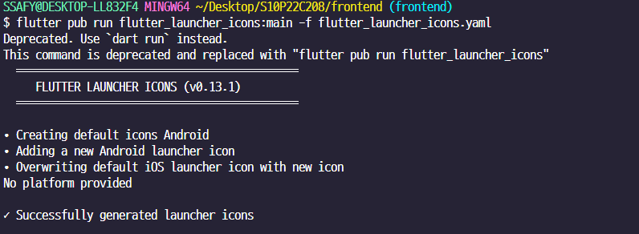

# 플러터 용어 정리 - 개인

### Prefer const with constant constructors
: `prefer const_constructors`는 dart의 lint 규칙 중 하나.  
`const` 생성자를 사용하면 객체를 컴파일 시간에 생성, 런타임 성능 향상 가능  
```yaml
analysis_options.yaml
rules:
  prefer_const_constructors : false
  prefer_const_literals_to_create_immutables: false
  prefer_const_constructors_in_immutables: false

```
하지만 항상 필요한 것은 아니다. 따라서 비활성화  
**굿**

## Widget ?
- 플러터는 위젯을 선언 후 동작
- 화면에 그려지는 UI 요소를 나타냄
- 상태가 변경되면 위젯 트리가 다시 빌드된다. (state)

### Text
- 위젯   
- 설명 : 화면에 텍스트를 표시하는 데 사용된다.
- 문자열과 스타일을 인수로 받는다.

## StatelessWidget
- state 에 변화가 생겨도 바뀌지 않음 => 화면에 고정적인 요소를 표시하는 데 사용된다.
## stateful
- state 에 변화가 생기면 같이 빌드됨  => 네트워크 응답, 사용자 입력으로 상태가 변경되는 요소를 표시하는 데 사용

## setState(() {}) 사용.
- state 의 변경에 사용된다 -> 위젯 트리가 다시 빌드된다. -> 화면에 변경된 상태가 반영된다. 
```dart
setState(() {
  customState = '1';
});
```
요롷게.
## Controller ?
- 상태 & 동작 관리 
- UI 요소와 로직 혹은 데이터 사이의 중개
##
##

##

##


## 사용 라이브러리
1. http : 
   > Flutter에서 HTTP 요청을 보내고 받는 데 사용하는 라이브러리.  
   > GET, POST, PUT, DELETE 등의 HTTP 메서드를 사용해 서버와 통신 할 수 있다.  
   > ++  JSON 데이터 가져오기, 파일 업로드, 웹 API 사용하는 작업에 사용된다. 
2. web3dart : 
   > Ethereum blockcahin과 상호작용 하기 위한 dart 라이브러리.    
   > Ethereum 스마트 컨트랙트 배포, 호출, 이벤트 감지, ether 전송, 주소 잔액 확인 등의 작업 수행 가능
3. provider : 
   > Flutter 상태 관리 라이브러리  ChangeNotifier를 사용하여 상태 변경을 알리고, Consumer나 Selector를 사용하여 변경된 상태를 수신한다
4. Crypto : 
   > Dart에서 다양한 암호화 알고리즘 제공  
   > web3dart 를 통해 스마트 컨트랙트를 배포 호출하며, crypto 라이브러리를 통해 데이터 전송 확인
5. flutter native splash : 
6. flutter launcher icons :
     
   아이콘 변경 
  