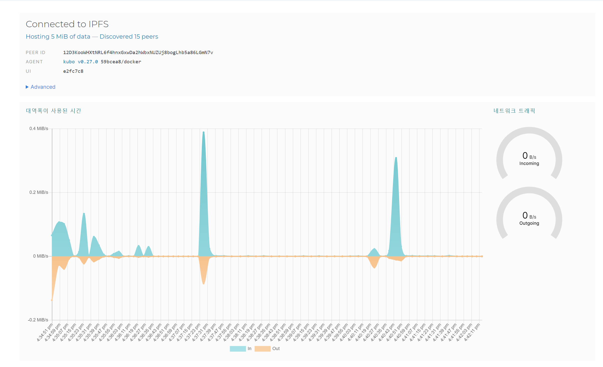

# ipfs 

## 목표
현재 flutter 앱에서 생성된 녹음 파일을 블록체인에 해싱하고, 추가적으로 프론트가 ipfs에 파일을 저장한다.


## 사용한 것
1. flutter dart
2. solidity
3. Ethereum ERC20, BIP32, BIP39
4. ipfs

## 과정
1. 도커에 ipfs 설치
  
```bash
docker pull ipfs/go-ipfs
```


2. 매핑

```bash
docker run -d --name ipfs_host -v /path/to/ipfs/staging:/export -v /path/to/ipfs/data:/data/ipfs -p 5000:4001 -p 5001:8080 -p 5002:5001 ipfs/go-ipfs:latest
```
포트 설명 
      1. 5000 : 기존의 4001 포트 IPFS 노드 간 피어 통신 
      2. 5002 : 기존의 5001 IPFS노드와 로컬 애플리케이션 간 통신 포트
      3. 5001 : 기존의 8080 IPFS HTTP API 접근 포트

1. 데몬 실행

```bash
docker exec -it ipfs_host ipfs daemon


# 설정하러 떠나봅시다.
# IPFS 데몬 중지
docker exec -it ipfs_host ipfs shutdown

# config 파일 수정
docker exec -it ipfs_host vi /data/ipfs/config

# Docker 컨테이너 재시작
docker restart ipfs_host

``` 
앗!!!! 

4. 도커에서 들어가서 config를 수정해줘야 한다. 

```bash 
docker exec -it ipfs_host sh # 도커 

vi /data/ipfs/config # 설정 파일 
ipfs config --json API.HTTPHeaders.Access-Control-Allow-Origin '["*"]' # CORS 
ipfs config --json API.HTTPHeaders.Access-Control-Allow-Methods '["PUT", "GET", "POST"]' # 

docker restart ipfs_host # 도커 ipfs 재시작
```

5. 5002 포트에 가서 ipfs 확인
5002/webui




6. GUI는 ipfs 이하의 파일만 보여주므로 업로드 되더라도 바로 반영되지 않습니다. 
> 해당 사항을 반영하기 위해서는 ipfs 에 접근해 ipfs files cp /ipfs/QmThing /파일명 명령을 실행합니다.
>
> 다만 MFS(Mutable File System)에 복사본 파일을 다시 저장하는 것으로 저장공간에 손해가 발생합니다.

...
블록체인과 IPFS(InterPlanetary File System)를 함께 사용할 때 장점

분산 스토리지: IPFS는 분산 파일 시스템으로, 데이터를 여러 노드에 분산 저장한다
 이는 기존의 서버 형식의 중앙 집중화를 방지하고, 
 
 단일 실패 지점을 제거하여 데이터의 내구성을 향상시킨다. 블록체인과 유사함.

데이터 무결성: 블록체인은 데이터의 무결성을 보장한다. IPFS와 함께 사용하면, 저장된 파일의 해시를 블록체인에 저장하여 파일이 변경되지 않았음을 증명할 수 있다.

효율성과 비용 절감: 블록체인에 직접 큰 파일을 저장하는 것은 비효율적이다. 하지만 IPFS를 사용하면, 파일의 해시만 블록체인에 저장하고 실제 파일은 IPFS에 저장할 수 있다. 이는 블록체인의 용량을 절약하고 트랜잭션 비용을 줄일 수 있다.

영속성: IPFS는 파일의 해시를 기반으로 데이터를 검색하므로, 데이터의 위치(서버DB)가 변경되더라도 해당 데이터에 접근할 수 있다. 이는 블록체인의 **불변성**과 잘 맞아떨어져, 영구적 데이터 저장.

즉 블록체인의 불변성 특성을 활용, IPFS 파일의 무결성을 보장할 수 있다.

```js 
// IPFS에 파일 업로드
const file = ... // 업로드할 파일
const ipfsResult = await ipfs.add(file);

// IPFS 해시를 블록체인에 저장
const ipfsHash = ipfsResult.path;
const txReceipt = await contract.methods.storeIPFSHash(ipfsHash).send({from: userAddress});
```
위의 코드에서 ipfs는 IPFS 클라이언트, contract는 블록체인 스마트 컨트랙트의 인스턴스, userAddress는 사용자의 블록체인 주소를 나타냅니다. storeIPFSHash는 IPFS 해시를 저장하는 스마트 컨트랙트의 함수입니다.

이렇게 하면 블록체인에 저장된 IPFS 해시를 사용하여 해당 파일이 변경되지 않았음을 증명할 수 있습니다. 블록체인에 저장된 해시와 IPFS에서 다운로드한 파일의 해시를 비교하여 파일의 무결성을 검증할 수 있습니다.
