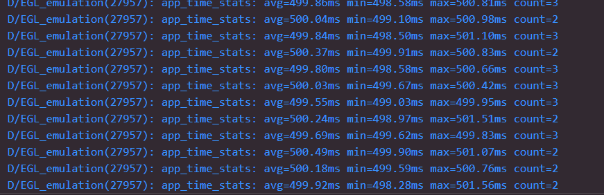
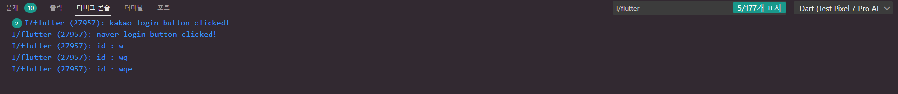
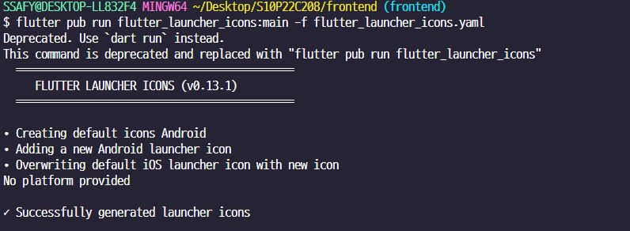

# 플러터 용어 정리 - 개인

### Prefer const with constant constructors
: `prefer const_constructors`는 dart의 lint 규칙 중 하나.  
`const` 생성자를 사용하면 객체를 컴파일 시간에 생성, 런타임 성능 향상 가능  
```yaml
analysis_options.yaml
rules:
  prefer_const_constructors : false
  prefer_const_literals_to_create_immutables: false
  prefer_const_constructors_in_immutables: false

```
하지만 항상 필요한 것은 아니다. 따라서 비활성화  
**굿**

## Widget ?
- 플러터는 위젯을 선언 후 동작
- 화면에 그려지는 UI 요소를 나타냄
- 상태가 변경되면 위젯 트리가 다시 빌드된다. (state)

### Text
- 위젯   
- 설명 : 화면에 텍스트를 표시하는 데 사용된다.
- 문자열과 스타일을 인수로 받는다.

## StatelessWidget
- state 에 변화가 생겨도 바뀌지 않음 => 화면에 고정적인 요소를 표시하는 데 사용된다.
## stateful
- state 에 변화가 생기면 같이 빌드됨  => 네트워크 응답, 사용자 입력으로 상태가 변경되는 요소를 표시하는 데 사용

## setState(() {}) 사용.
- state 의 변경에 사용된다 -> 위젯 트리가 다시 빌드된다. -> 화면에 변경된 상태가 반영된다. 
```dart
setState(() {
  customState = '1';
});
```
요롷게.
## Controller ?
- 상태 & 동작 관리 
- UI 요소와 로직 혹은 데이터 사이의 중개
## Margin / Padding
- Container 위젯의 `margin` 혹은 `padding` 속성을 사용해 마진을 설정할 수 있다.
- `EdgeInsets` 클래스를 사용해 크기를 설정할 수 있다.
## Align
- 위젯의 내부 여백을 의미한다.
- Align 위젯은 자식 위젯을 부모 위젯 내에서 특정 위치에 배치할 수 있게 해준다.
- Alignment.center, Alignment.topLeft 외... 를 사용해 특정 위치를 지정 할 수 있다.
## 

##

## 디버그 터미널에 너무 많은 정보가 나와서 불편할 때 
  

필터를 이용하자.
`I/flutter` 를 이용해 플러터에서 보내는 디버그 출력만 확인 할 수 있다.



## 사용 라이브러리
1. http : 
   > Flutter에서 HTTP 요청을 보내고 받는 데 사용하는 라이브러리.  
   > GET, POST, PUT, DELETE 등의 HTTP 메서드를 사용해 서버와 통신 할 수 있다.  
   > ++  JSON 데이터 가져오기, 파일 업로드, 웹 API 사용하는 작업에 사용된다. 
2. web3dart : 
   > Ethereum blockcahin과 상호작용 하기 위한 dart 라이브러리.    
   > Ethereum 스마트 컨트랙트 배포, 호출, 이벤트 감지, ether 전송, 주소 잔액 확인 등의 작업 수행 가능
3. provider : 
   > Flutter 상태 관리 라이브러리  ChangeNotifier를 사용하여 상태 변경을 알리고, Consumer나 Selector를 사용하여 변경된 상태를 수신한다
4. Crypto : 
   > Dart에서 다양한 암호화 알고리즘 제공  
   > web3dart 를 통해 스마트 컨트랙트를 배포 호출하며, crypto 라이브러리를 통해 데이터 전송 확인
5. flutter native splash : 
```bash
```
6. flutter launcher icons :
     
   아이콘 변경 
7. flutter carousel_slider :
   > 메인 배너 이미지 캐러셀
  
## MVVM 패턴
MVVM(Model-View-ViewModel)은 소프트웨어 아키텍처 패턴 중 하나로, 사용자 인터페이스의 설계와 비즈니스 로직을 분리하는 데 사용. MVVM 패턴은 세 가지 주요 구성 요소가 있음.

Model: 데이터와 비즈니스 로직을 담당. 데이터베이스, 네트워크, 파일 시스템 등과 같은 데이터 소스와 상호 작용하며, 애플리케이션의 상태와 동작을 관리.

View: 사용자에게 보여지는 UI를 담당. 사용자의 입력을 받아 ViewModel에 전달하고, ViewModel로부터 상태 변경을 받아 화면을 업데이트.

ViewModel: Model과 View 사이의 연결 고리 역할 합니다. View로부터 입력을 받아 Model을 업데이트하고, Model의 상태 변화를 View에 반영하기 위한 데이터를 준비.

MVVM 패턴의 주요 장점 : View와 Model 사이의 의존성을 최소화, 테스트와 유지 관리를 용이하게 하는 것. 또한, View와 ViewModel은 데이터 바인딩을 통해 연결되므로, 코드의 양을 줄이고 가독성을 향상.


### MVVM 패턴에 따른 copilot과의 대화?
> input : 
```
: 사용자 페이지 A 접근 2. 사용자 정보에 따라 A 페이지 데이터 호출 3. A 페이지 표시 4. 사용자 버튼 B와 상호작용 5. B 입력 전송 6. B 출력 수령 7. B 출력 표시 해당하는 예시 코드로 설명.
```

> output

>주어진 시퀀스를 MVVM(Model-View-ViewModel) 구조에 따라 나누고, Dart 언어로 예시 코드를 작성하면 다음과 같습니다:

>Model: 사용자 정보와 관련된 데이터와 로직을 담당합니다. 사용자 정보에 따라 A 페이지 데이터를 호출하는 로직이 이 부분에 해당합니다.

```

class UserModel {
  String? userInfo;

  Future<void> fetchUserData() async {
    // 로직: 사용자 정보에 따라 데이터를 호출
    // 예시: userInfo = await SomeDatabaseService.getUserInfo();
  }
}

```
> ViewModel: 사용자의 액션을 Model에 전달하고, Model로부터 데이터를 받아 View에 전달하는 역할을 합니다. 사용자가 페이지 A에 접근하는 액션과 버튼 B와 상호작용하는 액션, 그리고 이에 따른 데이터 호출 및 전송 로직이 이 부분에 해당합니다.
```
class UserViewModel {
  final UserModel _userModel = UserModel();

  Future<void> loadData() async {
    await _userModel.fetchUserData();
  }

  String? get userInfo => _userModel.userInfo;
}
```
> View: 사용자에게 보여지는 UI 부분을 담당합니다. A 페이지와 B 출력을 표시하는 부분이 이에 해당합니다.
```
class UserPage extends StatelessWidget {
  final UserViewModel _viewModel = UserViewModel();

  UserPage() {
    _viewModel.loadData();
  }

  @override
  Widget build(BuildContext context) {
    return Scaffold(
      appBar: AppBar(
        title: Text('Page A'),
      ),
      body: Center(
        child: Text('User Info: ${_viewModel.userInfo}'),
      ),
    );
  }
}
```
> 이렇게 MVVM 구조는 Model, View, ViewModel 세 부분으로 나누어져 있으며, 각 부분은 서로 독립적으로 동작하면서도 상호작용합니다. 이를 통해 코드의 재사용성과 유지보수성이 향상됩니다.

> input : 코드

> output

>제공된 코드는 MVVM(Model-View-ViewModel) 구조에서 ViewModel 부분에 속합니다.
>
>이 코드는 두 개의 ViewModel 클래스를 정의하고 있습니다: MemorialDetailViewModel과 LoginViewModel. 각 ViewModel은 사용자 인터페이스와 관련된 데이터와 로직을 캡슐화하고 있습니다.
>
>MemorialDetailViewModel은 사용자의 프로필 이미지 경로를 관리하며, LoginViewModel은 로그인 폼의 사용자 이름, 비밀번호, 포커스 상태를 관리하고 로그인 동작을 처리합니다.
>
>또한, 두 ViewModel 모두 ChangeNotifier를 상속받아 데이터가 변경될 때마다 관련된 View에 알림을 보낼 수 있습니다. 이를 통해 View는 최신 상태를 반영하여 사용자에게 보여줄 수 있습니다.
>
>추가되어야 할 Model은 다음과 같을 수 있습니다:
>
>UserModel: 사용자의 정보를 저장하고 관리하는 Model입니다. 이 Model은 사용자의 이름, 프로필 이미지 경로 등의 정보를 포함할 수 있습니다.
>
>LoginModel: 로그인 정보를 저장하고 관리하는 Model입니다. 이 Model은 사용자 이름, 비밀번호 등의 로그인에 필요한 정보를 포함할 수 있습니다.
>
>이러한 Model들은 데이터를 저장하고, 필요한 비즈니스 로직을 수행하며, ViewModel을 통해 View에 데이터를 제공합니다.


>네, 그렇습니다. username과 password는 사용자의 로그인 정보를 나타내는 데이터이므로, 이들은 Model에 위치하는 것이 적절합니다. ViewModel은 이러한 데이터를 Model로부터 가져와서 View에 제공하는 역할을 합니다.
>
>따라서, LoginModel을 만들고 username과 password를 이곳으로 이동시킬 수 있습니다. 그리고 LoginViewModel은 LoginModel을 사용하여 username과 password를 가져오고 설정하는 메서드를 제공할 수 있습니다.
>
>다음은 이를 반영한 코드 예시입니다:

```
class LoginModel {
  String _username = '';
  String _password = '';

  String get username => _username;
  String get password => _password;

  void setUsername(String value) {
    _username = value;
  }

  void setPassword(String value) {
    _password = value;
  }
}

class LoginViewModel extends ChangeNotifier {
  final LoginModel _loginModel = LoginModel();
  bool _isFocused = false;

  String get username => _loginModel.username;
  String get password => _loginModel.password;
  bool get isFocused => _isFocused;

  void setUsername(String value) {
    _loginModel.setUsername(value);
    notifyListeners();
  }

  void setPassword(String value) {
    _loginModel.setPassword(value);
    notifyListeners();
  }

  void setFocused(bool value) {
    _isFocused = value;
    notifyListeners();
  }

  void login() {
    debugPrint('Username: ${_loginModel.username}');
    debugPrint('Password: ${_loginModel.password}');
    debugPrint('clicked login button!');
  }
}
```

다음 문답.

```
모델 파일, 뷰모델 파일, 뷰 파일은 각기 다른 폴더에 저장하는게 좋을까?

GitHub Copilot
네, 그렇습니다. 각각의 파일을 별도의 폴더에 저장하는 것이 코드의 구조와 가독성을 향상시키는 데 도움이 됩니다.

MVVM(Model-View-ViewModel) 패턴을 사용하는 경우, 일반적으로 다음과 같은 폴더 구조를 사용합니다:

models: 이 폴더에는 애플리케이션의 데이터를 나타내는 모델 클래스가 포함됩니다. 예를 들어, UserModel, LoginModel 등의 파일이 이 폴더에 위치할 수 있습니다.

view_models: 이 폴더에는 View와 Model 사이의 중개자 역할을 하는 ViewModel 클래스가 포함됩니다. 예를 들어, LoginViewModel과 같은 파일이 이 폴더에 위치할 수 있습니다.

views: 이 폴더에는 사용자 인터페이스를 구성하는 View 클래스가 포함됩니다. 예를 들어, LoginView와 같은 파일이 이 폴더에 위치할 수 있습니다.

이렇게 파일을 분리하면, 코드의 관리가 용이해지고, 특정 기능을 찾기 쉬워집니다. 또한, 각각의 역할에 따라 파일을 분리함으로써 코드의 재사용성과 유지 보수성이 향상됩니다.
```

### 폴더구조 

네, 그렇습니다. 실제로 많은 Flutter 프로젝트에서는 화면(screen)과 위젯(widget)을 동일한 views 또는 widgets 폴더에 저장합니다.

화면(screen)은 일반적으로 앱의 주요 기능을 나타내는 큰 단위의 뷰를 의미하며, 위젯(widget)은 재사용 가능한 작은 단위의 뷰를 의미합니다.

그러나 프로젝트의 규모가 커지거나 위젯의 수가 많아질 경우, screens와 widgets 폴더를 별도로 만들어 관리하는 것이 코드의 가독성과 유지 보수성을 높일 수 있습니다.

따라서 폴더 구조는 프로젝트의 요구 사항과 팀의 코딩 스타일에 따라 달라질 수 있습니다. 중요한 것은 일관성 있는 코드 구조를 유지하는 것입니다.

### 한 폴더에 여러개의 class 

같은 파일에 여러 위젯 클래스를 나누는 것은 완전히 괜찮습니다. 이는 특히 그 위젯들이 서로 밀접하게 관련되어 있거나, 한 위젯이 다른 위젯에 의해 직접적으로 사용되는 경우에 유용합니다.

그러나, 각 위젯 클래스가 복잡하거나, 파일의 길이가 너무 길어지는 경우에는 각 위젯을 별도의 파일로 분리하는 것이 좋습니다. 이렇게 하면 코드의 가독성이 향상되고, 특정 위젯을 찾기 쉬워집니다.

따라서, 위젯을 한 파일에 모두 넣을지, 아니면 별도의 파일로 분리할지는 프로젝트의 요구 사항과 개발 팀의 코딩 스타일에 따라 결정될 수 있습니다. 중요한 것은 코드의 구조가 일관되고, 가독성이 좋아야 한다는 점입니다.


### changeNotifierProvider 사용할 시


```
import 'package:flutter/material.dart';
import 'package:provider/provider.dart';
import 'package:your_project/models/user_viewmodel.dart';

class UserPage extends StatelessWidget {
  @override
  Widget build(BuildContext context) {
    return ChangeNotifierProvider<UserViewModel>(
      create: (context) => UserViewModel()..loadData(),
      child: Scaffold(
        appBar: AppBar(
          title: Text('Page A'),
        ),
        body: Consumer<UserViewModel>(
          builder: (context, viewModel, child) {
            return Center(
              child: Text('User Info: ${viewModel.userInfo}'),
            );
          },
        ),
      ),
    );
  }
}
/*

 GitHub Copilot
ChangeNotifierProvider를 사용하여 UserViewModel의 상태를 관리하려면 다음과 같이 코드를 작성할 수 있습니다:

이 코드에서 ChangeNotifierProvider는 UserViewModel의 인스턴스를 생성하고, 이를 하위 위젯 트리에 제공합니다. loadData 메서드는 UserViewModel의 인스턴스가 생성될 때 호출됩니다.

Consumer<UserViewModel> 위젯은 UserViewModel의 현재 상태를 소비하고, UserViewModel의 상태가 변경될 때마다 자동으로 다시 빌드됩니다. 이를 통해 UserViewModel의 userInfo가 변경될 때마다 화면이 업데이트됩니다.
*/
```

### model 과 viewModel의 구분 기준
MVVM(Model-View-ViewModel) 패턴을 따르는 경우, 일반적으로 데이터와 관련된 로직은 Model에, UI와 관련된 로직은 ViewModel에 위치합니다. 따라서 username과 password와 같은 데이터는 Model에 위치하는 것이 적절합니다.

그러나 실제로는 프로젝트의 요구 사항과 복잡성에 따라 다르게 결정될 수 있습니다. 예를 들어, username과 password가 단순히 UI 상태를 나타내는 것이라면 ViewModel에 두는 것이 적절할 수 있습니다. 반면, 이들이 데이터베이스나 네트워크 요청 등과 관련된 복잡한 로직을 가지고 있다면 Model에 두는 것이 좋습니다.

따라서 위의 코드에서 username과 password를 Model로 분리할지 여부는 이들이 어떤 역할을 하는지, 그리고 프로젝트의 전반적인 구조와 요구 사항에 따라 결정될 수 있습니다.