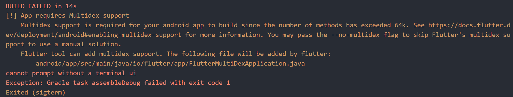

# 녹음

## 설치한 패키지
```
flutter_sound (9.4.6)

음성 녹음 / 재생 / 저장
```

```
permission_handler(11.3.0)

권한 요청 (마이크 권한 요청)
```

## 해결한 오류 1
두 가지 라이브러리를 설치하고 build를 하려니까 오류 발생


- 앱에서 다양한 라이브러리를 사용하면서, 사용하는 메서드가 64K(65,536개)보다 많아지면 Android 빌드 아키텍처의 한도에 도달하기 때문에 출력되는 오류이다.

이때 Multidex를 사용하면 메서드를 담은 dex 파일을 여러개로 쪼개어 불러오는 것으로 문제를 해결할 수 있다.


- 시도 1.
```
android/app/build.gradle 파일에

defaultConfig에 
    multiDexEnabled true

dependencies에
    # androidx를 사용하는 경우
    implementation 'androidx.multidex:multidex:2.0.1'
    # androidx를 사용하지 않는 경우
    implementation 'com.android.support:multidex:1.0.3'

androidx를 사용하는지 아닌지는 ROOT/android/gradle.properties에서 android.useAndroidX이 true인지 false인지 여부로 확인
```
-> androidx를 사용하는 것을 확인한 후 코드를 추가하고 build 해보았지만 실패


시도 2.
```
오류 코드 내 사이트 방문
https://docs.flutter.dev/deployment/android#enabling-multidex-support

flutter run --debug 실행 후 y
```

-> FlutterMultiDexApplication.java 파일 자동 생성되면서 build 성공


## 해결한 오류 2
녹음을 진행하기 위해서 openAudioSession과 closeAudioSession을 통해 AudioSession을 열고 닫아야 한다.

하지만, 두 가지 코드가 인식되지 않는 문제 발생

-> 버전 9부터 openRecorder, openPlayer로 함수 변경 되었는데, 공식 문서에 업데이트 되지 않아서 구글링을 통해 해결

## permission_handler 사용법
1. gradle.properties 파일에
```
android.useAndroidX=true
android.enableJetifier=true
```

2. android/app/build.gradle 파일에

compileSdkVersion을 33으로 설정
```
android {
  compileSdkVersion 33
  ...
}
```
다음과 같이 설정하니 34로 변경하라는 오류가 발생하여, 34로 진행

3. AndroidManifest.xml 파일에 권한 추가
AndroidManifest.xml파일은 debug, main, profile 총 세 가지 버전이 있는데, 공식 문서에 따라 main에만 추가

```
    <uses-permission android:name="android.permission.RECORD_AUDIO" />
    <uses-permission android:name="android.permission.FOREGROUND_SERVICE" />
```
