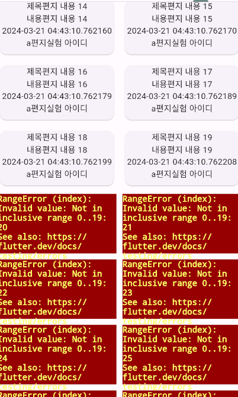
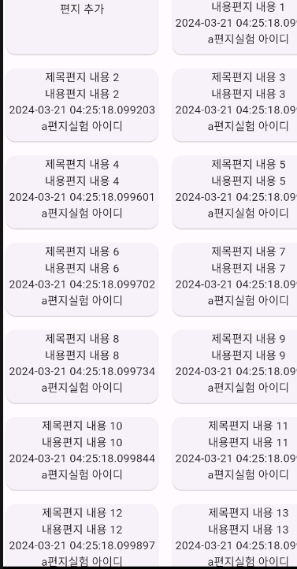

# 플러터 무한 스크롤 구현을 위한 몸부림

> 인스타그램은 정말 엄청난 무한스크롤의 성지였다. 대단해...

## 무한 스크롤?


## 무한 스크롤 구현 전 분석


### 구성요소
최상단요소 (여기서는 `screen`) :

```
Screen
|-- appBar  
    
|-- NestedScrollView : 스크롤을 공유시키기 위함
    |-- headerSliverBuilder :   
        |-- SliverList (screen 정보 출력 공간)  
    |-- body :
        |-- DetailTabBar : (탭 구분 후 이하 무한 스크롤 구현)
            |-- Column 
                |-- TabBar
                |-- Expanded
                      |-- TabBarView (무한스크롤)
                          |-- Tab1 (그리드 3) 
                          |   |-- CustomScrollView
                          |       |-- SlicverGrid
                          |           |-- Card
                          |-- Tab2 (그리드 1)
                          |    |-- 
                          |-- Tab3 ()


```
### `SliverChildBuilderDelegate`
 SliverChildBuilderDelegate는 필요에 따라 항목을 생성  
 ->  스크롤이 가능한 영역이 무한하게 확장될 수 있다.  

에러 : `viewModel.letters` 리스트의 길이는 미리 정해져 있다.   
 리스트의 인덱스를 벗어나는 항목에 접근하려고 하면 오류  
(불러와서 리스트에 add 하는 방식이므로 불러오기 전 까지 인덱스는 한정적이나, SliverChildBuilderDelegate는 무한하게 확장 : 인덱스가 없는 요소에 접근해서 오류.)  

해결 : 
`SliverChildBuilderDelegate`의 `childCount` 속성 설정  
 최대 Sliver 항목을 설정해준다.  
viewModel.letters.length + 1 설정 :  
    index 0 은 카드 추가 버튼의 자리   

결과 : 리스트의 모든 항목을 생성한 후, childCount를 넘어가는 index의 Sliver는 생성하지 않음

- childCount 작성 前  


- childCount 작성 後  
